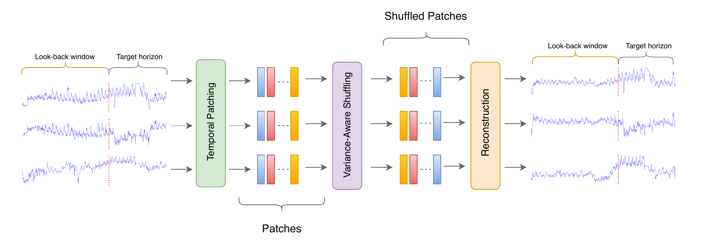

# Temporal Patch Shuffle (TPS): Leveraging Patch-Level Shuffling to Boost Generalization and Robustness in Time Series Forecasting [](https://arxiv.org/abs/2604.09067)


## Abstract 
Data augmentation is a crucial technique for improving model generalization and robustness, particularly in deep learning models where training data is limited. Although many augmentation methods have been developed for time series classification, most are not directly applicable to time series forecasting due to the need to preserve temporal coherence. In this work, we propose Temporal Patch Shuffle (TPS), a simple and model-agnostic data augmentation method for forecasting that extracts overlapping temporal patches, selectively shuffles a subset of patches using variance-based ordering as a conservative heuristic, and reconstructs the sequence by averaging overlapping regions. This design increases sample diversity while preserving forecast-consistent local temporal structure. We extensively evaluate TPS across nine long-term forecasting datasets using five recent model families (TSMixer, DLinear, PatchTST, TiDE, and LightTS), and across four short-term forecasting datasets using PatchTST, observing consistent performance improvements. Comprehensive ablation studies further demonstrate the effectiveness, robustness, and design rationale of the proposed method.

## Key Contributions
- **TPS (Temporal Patch Shuffle)**:
  - Time Series Forecasting implementation: `time_series_forecasting/utils/augmentations.py`
  - Univariate classification implementation (MiniRocket): `time_series_classification/minirocket/src/augmentation.py`
  - Multivariate classification implementation (MultiRocket): `time_series_classification/MultiRocket/augmentation.py`



## Repository Structure
- `time_series_forecasting/`: forecasting models + augmentation pipeline (TPS and others)
- `time_series_classification/`:
  - `minirocket/`: univariate classification (MiniRocket) + augmentations (TPS and others)
  - `MultiRocket/`: multivariate classification (MultiRocket) + augmentations (TPS and others)

## Quick Start

### 1) Time Series Forecasting

#### Dataset
Download all forecasting datasets from:
- https://drive.google.com/drive/folders/1ZOYpTUa82_jCcxIdTmyr0LXQfvaM9vIy

Create the dataset folder and put the downloaded files inside:
```bash
mkdir -p time_series_forecasting/dataset
```

#### Install & Run
```bash
git clone https://github.com/jafarbakhshaliyev/TPS.git
cd TPS

python3 -m venv .venv_forecasting
source .venv_forecasting/bin/activate

pip install -r time_series_forecasting/requirements.txt

# Install PyTorch (choose the right command for your CUDA/CPU setup):
# https://pytorch.org/get-started/locally/

bash time_series_forecasting/scripts/example.sh
```

Notes:
- `time_series_forecasting/scripts/example.sh` now runs relative to the repo
- The training entrypoint is `time_series_forecasting/run_longExp.py`.

### 2) Univariate Time Series Classification (MiniRocket)

#### Dataset (UCR Archive)
- https://www.cs.ucr.edu/~eamonn/time_series_data_2018/

The MiniRocket code expects TSV files under a folder you set in `time_series_classification/minirocket/src/main.py` via `UCR_PATH`.

#### Install & Run
```bash
cd TPS

python3 -m venv .venv_minirocket
source .venv_minirocket/bin/activate

pip install numpy pandas scikit-learn tqdm

# Run the provided script (SLURM `srun`):
bash time_series_classification/minirocket/scripts/example.sh

# If you're not on SLURM, run directly:
cd time_series_classification/minirocket
python3 ./src/main.py --dataset MiddlePhalanxOutlineAgeGroup
```

### 3) Multivariate Time Series Classification (MultiRocket)

#### Dataset (UEA Multivariate Archive)
- https://www.timeseriesclassification.com/index.php

Place `.ts` files under (recommended):
```bash
mkdir -p time_series_classification/MultiRocket/data/Multivariate_ts
```

#### Install & Run
MultiRocket has its own pinned dependencies in `time_series_classification/MultiRocket/requirements.txt`.

```bash
cd TPS

python3 -m venv .venv_multirocket
source .venv_multirocket/bin/activate

pip install -r time_series_classification/MultiRocket/requirements.txt

# The provided script uses SLURM `srun` and contains cluster-specific paths.
# For a portable local run, prefer calling `main.py` directly:
cd time_series_classification/MultiRocket
python3 main.py --datapath ./data/Multivariate_ts --problem FaceDetection --iter 5 --verbose 1
```

## Augmentation Code (Direct Links)
- Forecasting augmentations (TPS + others):
  - [`time_series_forecasting/utils/augmentations.py`](time_series_forecasting/utils/augmentations.py)
- MiniRocket augmentations (TPS + others):
  - [`time_series_classification/minirocket/src/augmentation.py`](time_series_classification/minirocket/src/augmentation.py)
- MultiRocket augmentations (TPS + others):
  - [`time_series_classification/MultiRocket/augmentation.py`](time_series_classification/MultiRocket/augmentation.py)

## Results

Headline numbers from the tables:
- Long-term forecasting (9 datasets × 4 horizons): TPS is rank-1 in most settings (e.g., **DLinear**: 35/36 wins for MSE; 34/36 wins for MAE).
- Short-term traffic forecasting (PeMS03/04/07/08 with PatchTST): TPS wins on most metrics (e.g., PeMS03: MSE/MAE **0.104/0.216**).
- Classification (mean ± std): TPS improves both univariate MiniRocket (**0.804 ± 0.0098**) and multivariate MultiRocket (**0.643 ± 0.0253**).

## Citation
If you find this repository useful, please cite our paper:

```bibtex
@misc{bakhshaliyev2026temporalpatchshuffletps,
      title={Temporal Patch Shuffle (TPS): Leveraging Patch-Level Shuffling to Boost Generalization and Robustness in Time Series Forecasting}, 
      author={Jafar Bakhshaliyev and Johannes Burchert and Niels Landwehr and Lars Schmidt-Thieme},
      year={2026},
      eprint={2604.09067},
      archivePrefix={arXiv},
      primaryClass={cs.LG},
      url={https://arxiv.org/abs/2604.09067}, 
}
```

## Acknowledgements
- Forecasting code credits: see headers in `time_series_forecasting/` files and references in `time_series_forecasting/`.
- MiniRocket is modified from the official implementation (see `time_series_classification/minirocket/LICENSE`).
- MultiRocket is modified from the official implementation (see `time_series_classification/MultiRocket/LICENSE`).
- Third-party attributions: `THIRD_PARTY_LICENSES.txt` inside each classification submodule.
